# Dynamic SM Allocation

Five fused compute+communication kernels on H100 (sm_90a), each benchmarked
with a statically partitioned CTA split against a dynamic one that reassigns
CTAs between the two roles at runtime.

| Directory | Kernel | Primary (compute) | Secondary (comm) | Dependency |
|-----------|--------|-------------------|------------------|------------|
| [`ag_gemm/`](./ag_gemm/) | Fused AG+GEMM | GEMM tiles | All-gather tiles | Comm→Compute |
| [`gemm_ar/`](./gemm_ar/) | GEMM+AR | GEMM tiles | All-reduce tiles | Compute→Comm |
| [`moe_dispatch_gemm/`](./moe_dispatch_gemm/) | MoE Dispatch+GEMM | GEMM tiles | Token dispatch | Comm→Compute |
| [`ring_attn/`](./ring_attn/) | Ring Attention | Partial attention blocks | KV forwarding | Compute→Comm |
| [`gemm_rs/`](./gemm_rs/) | GEMM+RS | GEMM tiles | Reduce-scatter tiles | Compute→Comm |

Each kernel directory holds its static baseline, its dynamic variant, and a
benchmark harness that writes CSV output into a `results/` folder. Figures live
in [`../figures/`](../figures/).

The kernels include `policies/scheduler_base.cuh` and `pyutils/torchutils.cuh`,
which the benchmark harnesses expect to find under `<repo>/include`. That
include tree is not vendored here; point the build at a checkout that provides
it before running anything.

## Problem formulation

A single GPU executes a fused kernel over `N` CTAs. Each CTA performs one of
two roles at any point in time:

- **Primary** (`n_p` CTAs): compute-intensive work — GEMM tiles, or
  partial attention for ring attention.
- **Secondary / helper** (`n_s` CTAs): communication or dispatch work —
  all-gather, all-reduce, MoE token dispatch, KV forwarding,
  reduce-scatter.

`n_p + n_s = N` at all times; a CTA switches roles by calling `try_join_helpers`
or `try_leave_helpers` against the shared `active_helpers` / `target_helpers`
counters. The global `target_helpers` is the sole actuator; a controller CTA
reads observable counters into a `WorkSample` each window and writes a new
target.

### Notation

| Symbol | Definition |
|--------|-----------|
| `N` | Total CTAs launched (`gridDim.x`) |
| `n_p` | Number of CTAs currently in the primary (compute) role |
| `n_s` | Number of CTAs currently in the secondary (comm/dispatch) role; `n_p + n_s = N` |
| `n_s*` | Optimal secondary CTA count that minimises makespan |
| `R_p` | Remaining primary tasks (GEMM tiles / attention blocks) |
| `R_s` | Remaining secondary tasks (comm tiles / dispatch blocks) |
| `C_p` | Per-task cost for primary stream (cycles per task, estimated online) |
| `C_s` | Per-task cost for secondary stream (cycles per task, estimated online) |
| `T_p` | Predicted finish time of primary stream: `R_p * C_p / n_p` |
| `T_s` | Predicted finish time of secondary stream: `R_s * C_s / n_s` |
| `T` | Makespan: `max(T_p, T_s)` |
| `delta_primary` | Primary tasks completed in the current controller window |
| `delta_secondary` | Secondary tasks completed in the current controller window |
| `delta_*_cycles` | Accumulated `clock64()` ticks (right-shifted by 10) in the current window |
| `blocked_primary_cycles` | Cycles where primary CTAs were stalled waiting on secondary data |

### Dependency structure

Two dependency patterns appear across the five kernels:

**Comm→Compute (AG+GEMM, MoE dispatch+GEMM).** Secondary must complete
before primary can proceed. In AG+GEMM, all-gather must land remote A-matrix tiles
before GEMM can multiply them. In MoE dispatch+GEMM, token dispatch must write row-readiness
flags before GEMM can process those rows. If `n_s` is too small, primary CTAs
stall waiting on secondary data.

**Compute→Comm (GEMM+AR, ring attention, GEMM+RS).**
Primary produces output tiles that secondary must transmit or reduce. If `n_p`
is too small, the comm pipeline starves.

### Optimization objective

Let `R_p`, `R_s` = remaining tasks for each stream, and `C_p`, `C_s` = per-task
cost (cycles). The makespan is:

```
T  =  max( T_p , T_s )
     where  T_p = R_p * C_p / n_p
            T_s = R_s * C_s / n_s
```

subject to `n_p + n_s = N`. Setting `T_p = T_s` and solving for `n_s`:

```
n_s*  =  N * (R_s * C_s) / (R_p * C_p + R_s * C_s)
```

`work_balance` implements this directly: CTAs are divided in proportion to the
remaining total work on each side, where "work" is task count times per-task
cost rather than task count alone. The hard part is estimating `C_p` and `C_s`
online and handling the edge cases — stalls, stream completion, noisy cost
windows.

### Online estimation

The controller estimates `C_p` and `C_s` from `clock64()` accumulators
right-shifted by 10 to fit 32 bits. Two modes are available:

- **Windowed**: `C_x = delta_x_cycles / delta_x` over the most recent controller
  window. More responsive but noisier.
- **Cumulative**: `C_x = total_x_cycles / total_x_done`. Stable running average
  but sluggish when cost changes mid-kernel.

### The stall case

When `n_s` falls below the threshold needed to sustain all-gather throughput,
primary CTAs block entirely (`delta_primary = 0`). The formula is undefined
(`C_p → ∞`), but the limit gives `n_s* → N`. All policies handle this via an
explicit branch: when `delta_primary == 0`, set `target = helper_cap`.

## Policy

Policy implementation is in `include/policies/` of the include tree described above.

### `work_balance` (default for all five kernels)

Remaining-work-aware cost-balance policy. Operates in two modes depending
on the dependency direction:

**Mode 1 — cost-balance formula (all kernels).** Applies `n_s* = N · R_s·C_s /
(R_p·C_p + R_s·C_s)` from above, with costs taken from direction-aware windowed
cycle counters blended with cumulative counters for stability.

**Mode 2 — overflow mechanism (AG+GEMM only).** When a primary CTA is blocked waiting on remote data (barrier spin),
`try_join_helpers_overflow` allows it to temporarily switch to the helper
role even if `active_helpers` already equals the controller target. The
active count may exceed the target by up to `overflow_margin` (capped by
`helper_cap`). This is self-regulating: more blocked CTAs cause more
overflow joins, which accelerates comm, which unblocks compute, which
reduces overflow pressure. CTAs that overflowed leave via the normal
`try_leave_helpers` path, which drains active back toward the target.

Key properties:

- Light step damping — `max_step = max(N/4, 4)` allows convergence in
  ~3-4 updates while preventing oscillation from noisy cost windows
- Direction-aware cost estimation — `blocked_primary_cycles` enters C_s only
  when `secondary_blocks_primary = true` (AG+GEMM). For the compute→comm
  kernels, C_s uses only `secondary_cycles` to avoid inflation.
- Cumulative cost blending — for comm→compute, windowed costs are
  blended 50/50 with cumulative (all-time) costs to smooth out per-window
  noise from `blocked_primary_cycles` oscillation
- Initial target — for AG+GEMM, starts at `helper_floor` (the overflow mechanism
  compensates if the initial target is too low). For the compute→comm kernels, uses a
  conservative geometric mean of floor and task ratio.
- Smaller min_window — `max(N/16, 2)` for faster reaction
- Zero tunable parameters — `secondary_blocks_primary` is a structural
  boolean derived from the dependency direction, not a tuned knob

| Edge case | Action |
|-----------|--------|
| Secondary done | `target = 0` |
| Primary done | `target = helper_cap` |
| Primary stalled | `target = helper_cap` |
| Secondary stalled | Ramp up by `max_step` |
| Insufficient data | Hold previous target |

## Results

### Combined overview

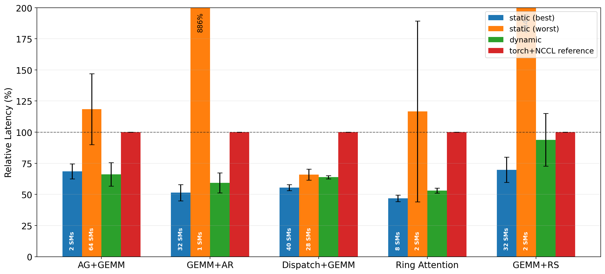
*8-GPU overview — relative latency vs torch+NCCL baseline. Static best (blue)
reaches 50–80% of torch+NCCL; dynamic (green) falls between static best and
worst. Static worst (orange) exceeds 600% for GEMM+AR and 390% for GEMM+RS,
showing high sensitivity to SM partition.*

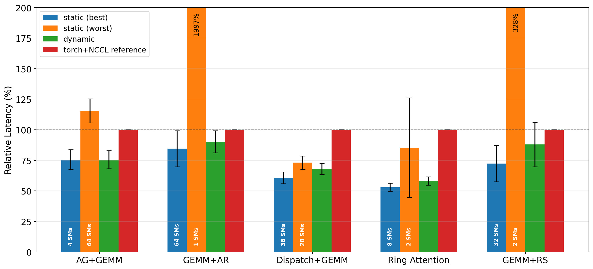
*4-GPU overview — dynamic tracks closer to static worst on AG+GEMM but achieves
near-parity on GEMM+AR and GEMM+RS. Static worst reaches 1995% for GEMM+AR,
illustrating extreme sensitivity.*

### Per-kernel results (4 GPUs)

Speedup = `static_best_ms / dynamic_ms`. Values above 1.0× mean the dynamic
policy wins.

---

#### Fused AG+GEMM (`ag_gemm/`)

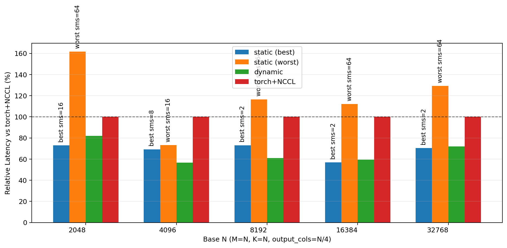
*AG+GEMM 8-GPU SM sweep — static best at 4 SMs (comm→compute needs few
helpers). Dynamic overshoots at all shapes, worst gap at N=8192 (121% vs 80%
static best).*

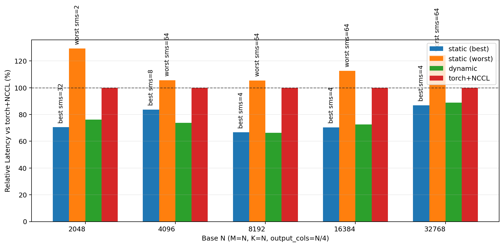
*AG+GEMM 4-GPU SM sweep — only two shapes benchmarked. Dynamic exceeds
torch+NCCL at both, while static best is 67–83% of baseline.*

| M=K | Static best (ms) | Best SMs | Dynamic (ms) | Speedup |
|-----|-------------------|----------|--------------|---------|
| 2048 | 0.062 | 16 | 0.090 | 0.69× |
| 4096 | 0.150 | 16 | 0.214 | 0.70× |
| 8192 | 0.478 | 4 | 0.819 | 0.58× |
| 16384 | 2.902 | 2 | 5.255 | 0.55× |
| 32768 | 26.482 | 4 | 53.986 | 0.49× |

---

#### GEMM+AR (`gemm_ar/`)

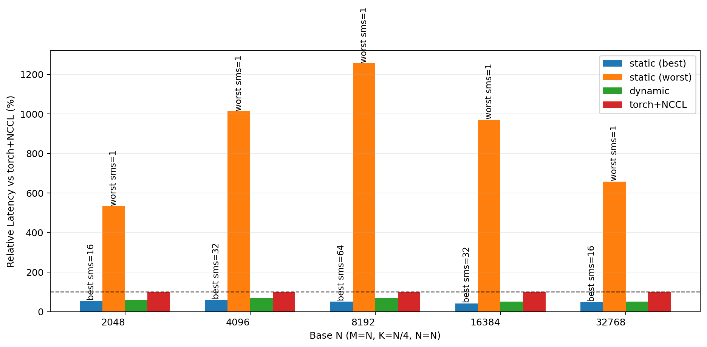
*GEMM+AR 8-GPU SM sweep — static best at 32 SMs across shapes, dynamic within
5–15% of static best. Worst-case static (2 SMs) is catastrophic (up to 900%).*

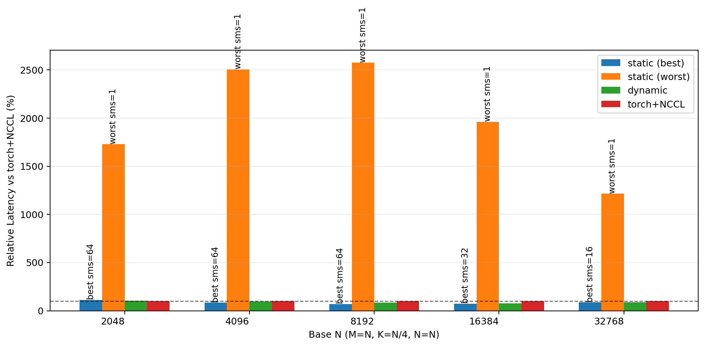
*GEMM+AR 4-GPU SM sweep — best static SM count shifts with shape (64→32→16
SMs). Dynamic is within 5–10% of static best at large shapes. Worst static at 1
SM is catastrophic (up to 2500%).*

| M | Static best (ms) | Best SMs | Dynamic (ms) | Speedup |
|---|-------------------|----------|--------------|---------|
| 2048 | 0.074 | 32 | 0.091 | 0.81× |
| 4096 | 0.189 | 64 | 0.191 | 0.99× |
| 8192 | 0.672 | 64 | 0.818 | 0.82× |
| 16384 | 3.678 | 32 | 3.840 | 0.96× |
| 32768 | 28.416 | 16 | 29.587 | 0.96× |

---

#### MoE Dispatch+GEMM (`moe_dispatch_gemm/`)

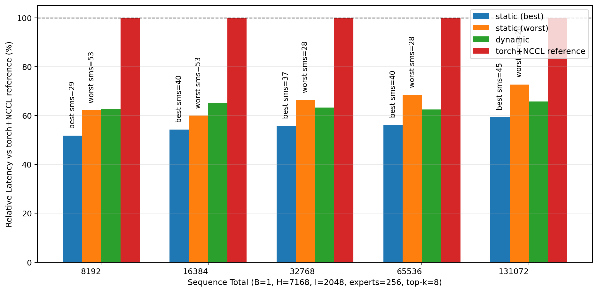
*MoE 8-GPU SM sweep — static best uses many dispatch SMs (28–44). Dynamic is
10–15% above static best. Best/worst static gap is narrow (~10–15%), making
optimal partition less critical.*

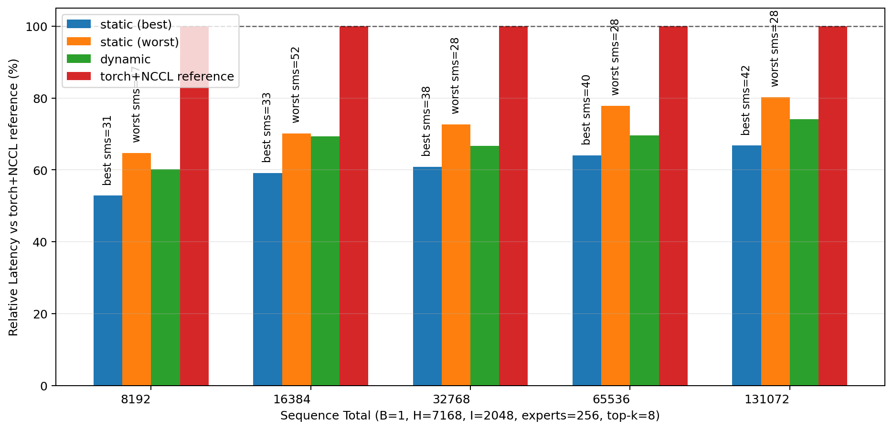
*MoE 4-GPU SM sweep — dynamic gap to static best grows at small shapes (65% vs
55% at seq=8192). At large shapes (seq=131072) the gap narrows to ~15%.*

| seq_total | Static best (ms) | Best SMs | Dynamic (ms) | Speedup |
|-----------|-------------------|----------|--------------|---------|
| 8192 | 1.254 | 36 | 1.488 | 0.84× |
| 16384 | 2.171 | 32 | 2.532 | 0.86× |
| 32768 | 4.058 | 39 | 4.618 | 0.88× |
| 65536 | 8.338 | 40 | 9.623 | 0.87× |
| 131072 | 17.288 | 44 | 19.540 | 0.88× |

---

#### Ring Attention (`ring_attn/`)

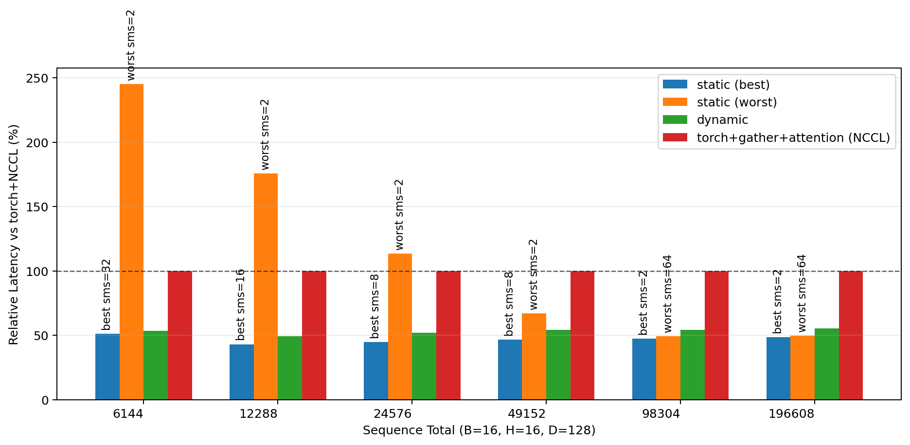
*Ring attn 8-GPU SM sweep — dynamic tracks static best closely at all shapes
(within 5–10%). Best static SM count varies widely (64→8→4→16 SMs). Worst-case
sensitivity highest at small sequences.*

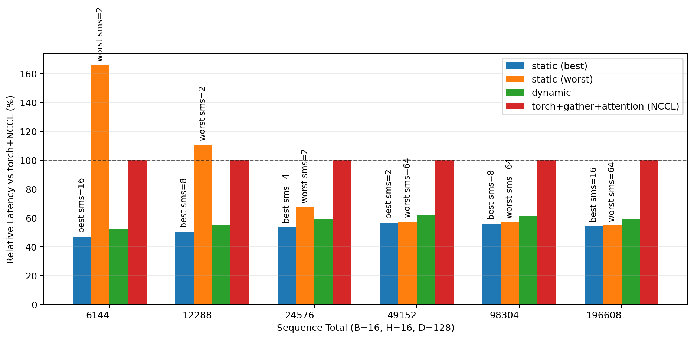
*Ring attn 4-GPU SM sweep — dynamic is within 5–15% of static best. At large
sequences the static partition becomes less sensitive (best/worst gap < 10%),
reducing the value of dynamic allocation.*

| seq_total | Static best (ms) | Best SMs | Dynamic (ms) | Speedup |
|-----------|-------------------|----------|--------------|---------|
| 6144 | 2.855 | 16 | 3.409 | 0.84× |
| 12288 | 9.766 | 8 | 10.217 | 0.96× |
| 24576 | 35.898 | 8 | 38.043 | 0.94× |
| 49152 | 135.876 | 4 | 148.252 | 0.92× |
| 98304 | 523.422 | 8 | 568.572 | 0.92× |
| 196608 | 2053.806 | 8 | 2229.122 | 0.92× |

---

#### GEMM+RS (`gemm_rs/`)

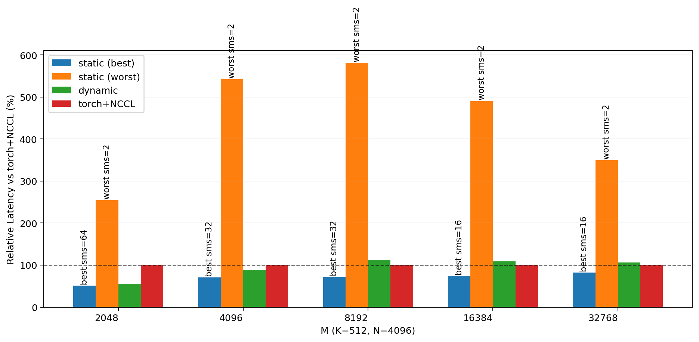
*GEMM+RS 8-GPU SM sweep — dynamic matches torch+NCCL baseline at all shapes.
Static best is 50–85% of baseline. Worst-case static (2 SMs) is catastrophic
(up to 530%).*

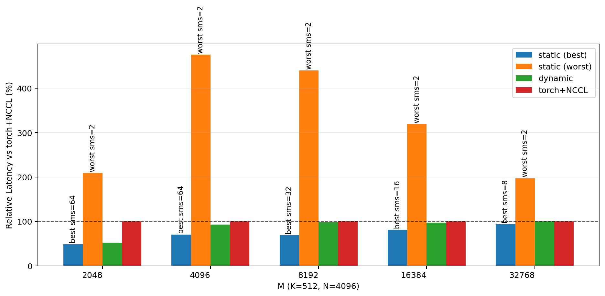
*GEMM+RS 4-GPU SM sweep — best static SM count shifts from 64 (small M) to 8
(large M). Dynamic converges toward static best at M=32768 (94% vs 91%).
Worst-case gap narrows at large shapes.*

| M | Static best (ms) | Best SMs | Dynamic (ms) | Speedup |
|---|-------------------|----------|--------------|---------|
| 2048 | 0.043 | 64 | 0.041 | 1.05× |
| 4096 | 0.117 | 64 | 0.170 | 0.69× |
| 8192 | 0.475 | 32 | 0.671 | 0.71× |
| 16384 | 3.390 | 16 | 3.903 | 0.87× |
| 32768 | 28.017 | 8 | 29.043 | 0.96× |

---

### Observations

GEMM+AR and GEMM+RS meet the 5%-of-static-best target at large shapes:
`work_balance` reaches 0.96× of static best at M=32768 on both (4.4% and 3.7%
overhead). Overhead shrinks with shape across the board, since the fixed cost of
running the controller is amortized over more work.

Ring attention previously deadlocked. Non-floor CTAs looped forever once all
comm was done but the CTA-0 controller had already exited; with that fixed it
runs at 8.2% overhead at seq=98304.

MoE dispatch+GEMM is noisy — the comm→compute dependency combined with
stochastic multinomial routing makes cost estimation unstable. It sits at 13%
overhead at seq=131072, but infrastructure alone accounts for ~8.6%, so
structural costs dominate rather than policy decisions.

AG+GEMM is the hard case. The comm→compute dependency means helpers must ramp
*before* compute stalls, and a reactive policy cannot do that. 84% total
overhead at M=32768, of which 128% is infrastructure — it needs a different
approach rather than tuning.

Splitting total overhead into infrastructure and policy contributions:

| Kernel | Infra | Policy | Total |
|--------|-------|--------|-------|
| GEMM+RS | 6.0% | -3.1% | 2.9% |
| GEMM+AR | 6.2% | -1.8% | 4.4% |
| Ring attention | 5.3% | +2.8% | 8.2% |
| MoE dispatch+GEMM | 8.6% | +2.3% | 10.8% |
| AG+GEMM | 128.3% | -44.3% | 84.0% |

### Planned: slack-aware dependency policy

For the comm→compute kernels (AG+GEMM, MoE dispatch+GEMM), the reactive
cost-balance policy only detects stalls after they happen. A predictive
extension would model the producer-consumer buffer ("slack") between comm and
compute so it can head stalls off instead.

